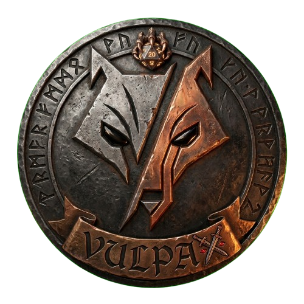

<div align="center">



# ⚔️ Vulpax DnD

**Masaüstü tabanlı, gerçek zamanlı çok oyunculu dijital masa RPG'si**

[](https://github.com/EmreGocerDev/VulpaxDND/releases)
[](https://github.com/EmreGocerDev/VulpaxDND/releases)
[](#lisans)
[](https://electronjs.org)
[](https://reactjs.org)

[📥 İndir](#-indirme-ve-kurulum) · [🎮 Özellikler](#-özellikler) · [🗺️ Ekranlar](#%EF%B8%8F-ekranlar) · [🔧 Geliştirici](#-geliştirici-kurulum)

</div>

---

## 📥 İndirme ve Kurulum

### 🪟 Windows
sudo xattr -rd com.apple.quarantine "/Applications/Vulpax DnD.app" && sudo chmod -R 755 "/Applications/Vulpax DnD.app"
cd "w:\Vulpax Dnd"; npx vite build; npx electron-builder --win
1. [Releases](https://github.com/EmreGocerDev/VulpaxDND/releases) sayfasından en son **`Vulpax DnD Setup x.x.x.exe`** dosyasını indir.
2. `.exe` dosyasına **çift tıkla** ve kurulumu tamamla.
3. Masaüstündeki kısayoldan oyunu başlat.
4. Uygulama otomatik olarak güncelleme kontrol eder. Güncelleme hazır olduğunda bildirim gelir, uygulama kapanırken yüklenir.

> **Not:** Windows SmartScreen uyarısı çıkarsa → "Daha fazla bilgi" → "Yine de çalıştır" seç.

---

### 🍎 macOS

1. [Releases](https://github.com/EmreGocerDev/VulpaxDND/releases) sayfasından en son **`Vulpax DnD-x.x.x.dmg`** dosyasını indir.
2. İndirilen `.dmg` dosyasına çift tıklayarak aç.
3. Açılan pencerede **Vulpax DnD logosunu Applications (Uygulamalar) klasörüne sürükle**.
4. `.dmg` penceresini kapat ve eject et.

> ⚠️ **İlk açılışta önemli adım:**  
> Uygulamaya **çift tıklama**, bunun yerine **sağ tıkla → "Aç"** (Open) seç.  
> Çıkan küçük uyarı penceresinde tekrar **"Aç"** seç.  
> Bu adımı sadece ilk seferinde yapman yeterli — sonraki açılışlarda normal çift tıkla çalışır.  
>
> *Bu uyarı Apple'ın noter onayı gerektiren Gatekeeper korumasından kaynaklanır. Uygulama tamamen güvenlidir.*

---

## 🎮 Özellikler

### 🏰 Genel
| Özellik | Açıklama |
|---|---|
| 🌐 Gerçek Zamanlı | Supabase altyapısı ile anlık veri senkronizasyonu |
| 🎙️ Sesli Sohbet | WebRTC tabanlı oyun içi ses kanalı |
| 🎲 3D Zar | D4, D6, D8, D10, D12, D20 animasyonlu 3D zarlar |
| 🗺️ Savaş Haritası | 16×16 taktiksel grid harita sistemi |
| 🃏 Güç Kartları | Animasyonlu 3D flip güç kartı sistemi |
| 🎵 Müzik Sistemi | 19 farklı ortam müziği, DM tarafından kontrol edilir |
| 🏆 Başarımlar | 12+ açılabilir başarım rozeti |
| 🪙 Ekonomi | Altın sistemi, market, lootbox ve promo kodları |
| 📖 Lore | Dünya tarihi ve karakter geçmişleri |
| 🔄 Otomatik Güncelleme | Uygulama kendini otomatik olarak günceller |

---

## 🗺️ Ekranlar

### 🔐 Giriş Ekranı
- E-posta ve şifre ile kayıt / giriş
- Kullanıcı adı doğrulama (min. 3 karakter)
- Yükleme ve hata durumu yönetimi

---

### 🏠 Lobi Ekranı
- Aktif oyun odalarının listesi (oda adı, DM adı, oyuncu sayısı, durum)
- Yeni oda oluşturma veya kod ile odaya katılma
- Altın bakiyesi göstergesi ile hızlı market erişimi
- Arkadaşlar kenar çubuğu (sağ panel)
- Patch notları butonu
- Profil, Ayarlar, Market, Lore erişimi

---

### 🚪 Oda Ekranı
- Oyuncu listesi (kullanıcı adı, karakter adı, durum rozeti)
- Karakter seçim paneli (DM olmayan oyuncular için)
- Sohbet kutusu ve aksiyon günlüğü
- Sesli sohbet bağlantısı
- DM oyunu başlatır; tüm oyuncuların karakter seçmesi beklenir
- **Oyun Modları:** Hayal Gücü Modu (anlatı tabanlı) veya Test Modu (solo)
- Oda kodu paylaşım ekranı

---

### ⚔️ Oyun Ekranı *(En Kompleks Ekran)*

**Sol Panel — Oyuncu Durumu**
- Tüm oyuncuların avatar, kullanıcı adı, karakter adı, ünvan rozeti
- Renk kodlu HP çubuğu (🟢 yüksek / 🟡 orta / 🔴 düşük)
- Durum rozeti: Diri / Ölü / Sersem / Zehirli / Güçlendirilmiş
- 3D animasyonlu zar tepsisi

**Orta Alan — Oynanış**
- Aktif savaş rozeti, zamanlayıcı, altın göstergesi (+5 her 30 saniyede)
- Harita çekmecesi (tam ekran savaş haritası, oyuncu bıçak ikonları ile)
- **Hayal Gücü Modu:**
  - Sıra yönetimi (DM sıra atar)
  - Güç kartı kullanımı → DM onayı → etki uygulanır
  - Macera Günlüğü (DM anlatısı, zar sonuçları, kart kullanımları)
  - Tam ekran zar atma ve sıra duyurusu animasyonları
  - DM müzik seçici (19 parça), SFX ses kontrolü

**Sağ Kenar Çubuğu**
- Müzik ve efekt ses kaydırıcıları
- Gerçek zamanlı sohbet kutusu
- Aksiyon günlüğü (zar, kart, narrasyon, sohbet ikonları ile)
- Sesli sohbet (mikrofon/sağır butonları, bağlı kullanıcı listesi)

**DM Araçları (sadece DM'e görünür)**
- 🎮 **DM Kokpiti:** Karakter HP düzenleme (+10/+1/-1/-10/MAX), saldırı/savunma/çeviklik/zeka/karizma bonusları, öldür/dirilt/güçlendir, zehir & sersemletme yönetimi
- 📋 **DM Notları:** Oyun sırasında yapışkan notlar (pinlenebilir, tarih damgalı)
- 🎵 **Müzik Seçici:** 19 parçalık oyun içi müzik listesi
- 🃏 **Kart Sıfırlama:** Tüm oyuncuların kullanılmış kart takibini temizler
- 📖 **DM Hikaye Kartları:** Kategori bazlı hazır senaryo kartları:
  - `yol`, `zindan`, `arkadaslik`, `festival`, `savas`, `gizem`, `tuzak`, `ticaret`
  - Zorluk: kolay / orta / zor / efsanevi
- 👹 **Canavar Kitabı:** Tüm canavarların bestiary'si (Türkçe isimler, istatistikler)
- 👺 **Canavar Karşılaşması:** Tier (Minyon/Standart/Elit/Boss) ve sayı seçerek canavar spawn et, hasar ver, XP ver, öldür

---

### 👤 Profil Ekranı
- Avatar yükleme (JPG/PNG/GIF/WEBP, maks. 2MB)
- Kullanıcı adı düzenleme
- Donanımlı ünvan gösterimi
- Altın bakiyesi, oynanan oyun sayısı, envanter sayısı
- Karakter ve güç kartı envanteri
- Hesap bilgileri ve çıkış

---

### 🛒 Market Ekranı

| Sekme | İçerik |
|---|---|
| ⚔️ Karakterler | Satın alınabilir karakter şablonları (istatistik ve nadirlik ile) |
| 🃏 Güçler | Güç kartları (etki türü, nadirlik, değer) |
| 👑 Ünvanlar | Özel başlıklar: `<Soylu>`, `<Bilge>` vb. |
| 📦 Lootbox | Rastgele nadirlik kutuları |
| 🔑 Kod Kullan | Promosyon kodu bozma (tek kullanım, altın ödülü) |
| 🎒 Envanter | Sahip olunan tüm eşyalar (arama + filtreleme + ekipman yönetimi) |

**Nadirlik sistemi:** ⚪ Yaygın → 🟢 Az Yaygın → 🔵 Nadir → 🟣 Destansı → 🟡 Efsanevi

---

### 📚 Lore Ekranı
- Dünya haritası görseli
- Ana lore hikayeleri (süslü kart tasarımı)
- Bölgeye göre karakterler
- Tıklanabilir karakter kartları → tam ekran karakter modalı (istatistikler, geçmiş, bölge)

---

### ⚙️ Ayarlar Ekranı
- **Ses:** Ana ses, müzik, efekt, sesli sohbet ses seviyeleri
- **Görünüm:** HP çubuğu, hasar sayıları, zar animasyonu, azaltılmış animasyonlar, tam ekran, sohbet yazı boyutu
- **Oyun:** Bildirimler, otomatik initiative, dil seçimi (Türkçe/İngilizce)
- Kaydet ve varsayılana sıfırla

---

### 🛡️ Admin Ekranı *(Yetkilendirilmiş hesap)*
- **Karakterler:** Oluştur / Düzenle / Sil (ad, HP, ATK, DEF, nadirlik, bölge, görsel yolu)
- **Güç Kartları:** Oluştur / Düzenle / Sil (etki türü, etki değeri, nadirlik)
- **Ünvanlar:** Oluştur / Düzenle / Sil
- **Lore Hikayeleri:** Oluştur / Düzenle / Sil (sıra, başlık, içerik)
- **Karakter Hikayeleri:** Oluştur / Düzenle / Sil
- **DM Hikaye Kartları:** Kategori/zorluk bazlı senaryo kartları yönetimi
- **Promosyon Kodları:** Kod, ödül altını, maks. kullanım, son kullanım tarihi, aktif/pasif durumu

---

## 🎲 Oyun Mekanikleri

### Savaş Sistemi
```
Hasar Formülü: (Saldırı - Savunma/2) + Güç Bonusu × Zar Çarpanı

💥 KRİTİK  → D20 doğal 20 = çift hasar
💀 FUMBLE  → D20 doğal 1  = yarı hasar
```

### Güç Kartları
| Etki Türü | Açıklama | Bekleme Süresi |
|---|---|---|
| saldiri | Doğrudan hasar | Nadirliğe göre |
| zehir | 3 tur hasar | Nadirliğe göre |
| sersemletme | 3 tur kart kullanamaz | Nadirliğe göre |
| diriltme | Ölüden diriltir | Nadirliğe göre |
| can | HP iyileştirir | Nadirliğe göre |
| savunma+ | Kalıcı savunma artar | Nadirliğe göre |
| atak+ | Kalıcı saldırı artar | Nadirliğe göre |
| savunma-kırıcı | Hedef savunmayı düşürür | Nadirliğe göre |
| atak-kırıcı | Hedef saldırıyı düşürür | Nadirliğe göre |

**Bekleme Süreleri:** ⚪ 15sn → 🟢 30sn → 🔵 30sn → 🟣 45sn → 🟡 60sn

### Ekonomi
```
🪙 Oyun içi kazanım   → +5 altın / 30 saniye
⚔️  Canavar öldürme  → Tier'a göre XP + altın
📦 Lootbox           → Değişken ödüller
🔑 Promo kodu        → Admin tanımlı miktarlar
```

### XP & Seviye
```
Sonraki seviye için gereken XP = 100 × 1.5^(seviye−1)
```

### Durum Efektleri
| Durum | Etkisi |
|---|---|
| ✅ Diri | Normal, kart kullanabilir |
| 💀 Ölü | Aksiyon yok, diriltilmeyi bekler |
| 😵 Sersem | Kart kullanamaz, her tur azalır |
| ☠️ Zehirli | Her tur hasar alır, her tur azalır |
| ✨ Güçlendirilmiş | DM tanımlı stat artışı |

---

## 🔧 Geliştirici Kurulum

### Gereksinimler
- Node.js 18+
- npm 9+

### Kurulum

```bash
git clone https://github.com/EmreGocerDev/VulpaxDND.git
cd VulpaxDND
npm install
```

### Geliştirme Modu

```bash
npm run dev
```
Vite ve Electron eş zamanlı başlar. Tarayıcı `http://localhost:5173`'te açılır.

### Build Komutları

```bash
# Windows installer (.exe)
npm run build:win

# macOS disk imajı (.dmg + .zip)
npm run build:mac

# Windows + GitHub'a yayınla
npm run release

# macOS + GitHub'a yayınla
npm run release:mac
```

Çıktılar `release/` klasörüne kaydedilir.

### Proje Yapısı

```
├── electron/
│   ├── main.js          # Ana Electron süreci, pencere yönetimi, auto-updater
│   └── preload.js       # Güvenli köprü (contextBridge)
├── src/
│   ├── screens/         # 11 tam sayfa ekranı
│   ├── components/      # 17+ yeniden kullanılabilir bileşen
│   ├── stores/          # Zustand global durum yönetimi
│   ├── lib/             # Supabase istemcisi, ses yardımcıları
│   └── styles/          # Global CSS (medieval tema)
├── supabase/            # SQL şema ve göç dosyaları
├── build/               # Electron-builder kaynakları (ikonlar, BMP)
├── public/              # Statik dosyalar (harita, müzik, kart görselleri)
└── assest/              # Uygulama ikonu ve logosu
```

### Ortam Değişkenleri

`src/lib/supabase.js` dosyasında aşağıdaki değerleri kendi Supabase projenle güncelle:

```js
const SUPABASE_URL = "https://xxxxx.supabase.co";
const SUPABASE_ANON_KEY = "your-anon-key";
```

---

## 🧰 Teknoloji Yığını

| Katman | Teknoloji |
|---|---|
| Masaüstü Çerçevesi | Electron 28 |
| Frontend | React 18 + React Router 6 |
| Bundler | Vite 5 |
| Backend / Auth / Realtime | Supabase (PostgreSQL + WebSocket) |
| Durum Yönetimi | Zustand |
| Animasyon | Framer Motion |
| Sesli Sohbet | WebRTC (simple-peer) |
| Otomatik Güncelleme | electron-updater |
| CI/CD | GitHub Actions (macOS builds) |
| Test | Playwright (WebKit ekran görüntüsü testi) |
| Installer | NSIS (Windows), DMG (macOS) |

---

## 🚀 GitHub Actions — Otomatik Mac Build

`.github/workflows/build-mac.yml` dosyası ile her `v*` tag push'unda otomatik olarak:

1. `macos-latest` runner üzerinde build alır
2. Playwright WebKit ile ekran görüntüsü çeker (görsel doğrulama)
3. `.dmg` ve `.zip` çıktılarını GitHub Releases'e yükler
4. `macos-visual-preview` artifact'ını Actions sekmesinde erişilebilir kılar

---

## 📦 Sürüm Geçmişi

Uygulama içi güncelleme notlarına **Lobi ekranındaki 📋 Patch Notes** butonundan ulaşabilirsiniz.

---

## 📄 Lisans

Bu uygulama özel bir lisans altındadır. Kopyalama, dağıtım ve tersine mühendislik yasaktır. Tüm haklar saklıdır © 2026 Emre Vulpax Gocer.

---

<div align="center">

**Vulpax DnD** — *Macera seni bekliyor.*

[🐛 Hata Bildir](https://github.com/EmreGocerDev/VulpaxDND/issues) · [💬 Topluluk](https://github.com/EmreGocerDev/VulpaxDND/discussions)

</div>